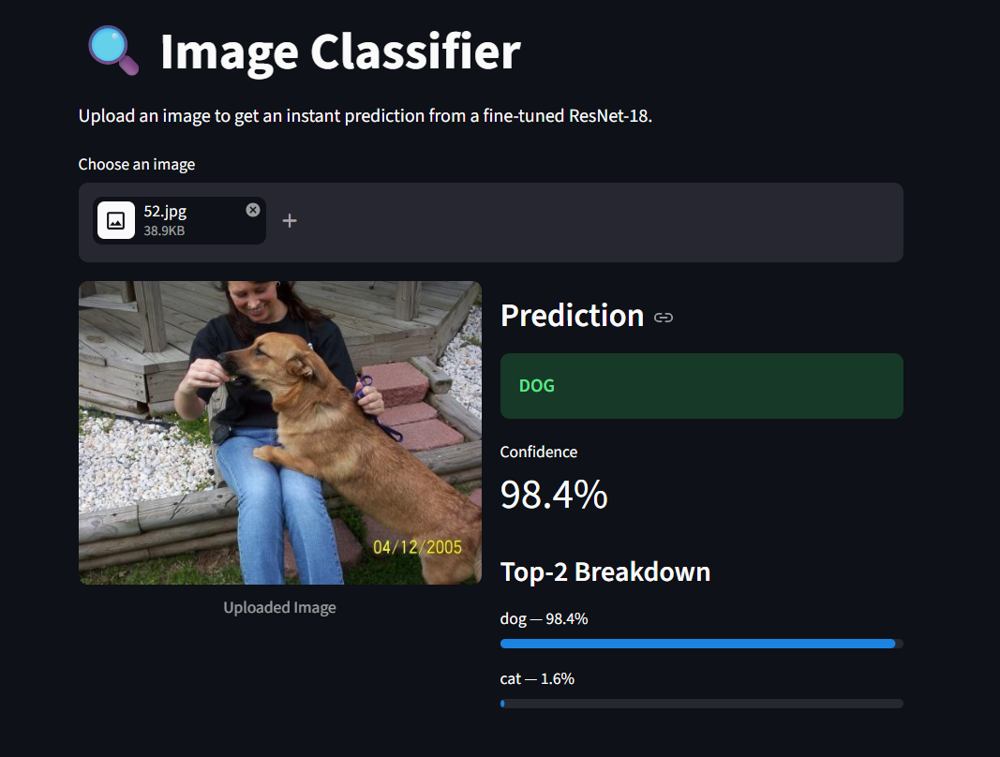
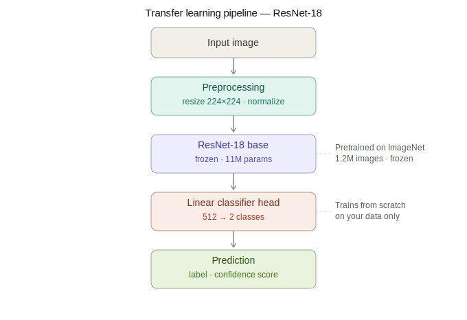

# 🐾 Image Classifier with Transfer Learning (ResNet-18)

**98.14% validation accuracy — trained in 5 epochs — deployed**

> A production-style image classifier built with transfer learning. Upload any image and get an instant prediction with confidence scores — no expensive GPU cluster required.

🔗 **[Live Demo → Streamlit App](https://resnet-18-image-classifier-kvmd7q7dec6rs4zvbxib6u.streamlit.app/)**

---

## What This Demonstrates

Most teams assume building an image classifier requires months of data collection and expensive cloud GPU time. This project shows that's not true.

Using transfer learning on ResNet-18 (pretrained on 1.2M images), I fine-tuned a 2-class image classifier in **under 10 epochs** and deployed it as a live web app. The same approach works for:

- **Product defect detection** — flag damaged items before they ship
- **Document type classification** — route invoices vs. receipts vs. contracts automatically  
- **Content moderation** — filter user-uploaded images at scale

---

## Results

| Metric | Value |
|--------|-------|
| Validation Accuracy | **98.14%** |
| Epochs Trained | 5 |
| Model Size | ~45 MB |
| Dataset | Cats vs Dogs (Microsoft) |

---

## How Transfer Learning Made This Possible

ResNet-18 was trained by Microsoft Research on ImageNet — 1.2 million images across 1,000 categories. Instead of training from scratch, I borrowed those 11 million learned parameters and replaced only the final classification layer with one tuned to my 2-class task.

**The three moves:**
1. Load pretrained weights → `ResNet18_Weights.DEFAULT`
2. Freeze all base layers → no gradient updates on existing knowledge
3. Replace the classifier head → only this layer trains from scratch

This is why you get 98%+ accuracy from a dataset you could collect in an afternoon.

---

## Project Structure

```
image-classifier/
├── script.py             # Full training pipeline
├── app.py                # Streamlit UI
├── model.pth             # Best saved weights (auto-checkpointed)
├── distribution.py       # Distribution of data into train and val
├── class_names.json      # classes
├── requirements.txt
└── data/
    ├── train/
    │   ├── cats/
    │   └── dogs/
    └── val/
        ├── cats/
        └── dogs/
```

---

## Demo



---

## Architecture



---

## Quickstart

**1. Clone and install**
```bash
git clone https://github.com/codewith-krishh/ResNet-18-image-classifier
cd ResNet-18-image-classifier
pip install -r requirements.txt
```

**2. Prepare your data**

Organize images in this structure (ImageFolder format):
```
data/train/class_a/   data/val/class_a/
data/train/class_b/   data/val/class_b/
```

**3. Train**
```bash
python script.py
```

Best model is automatically saved to `model.pth` after each epoch that improves validation accuracy.

**4. Run the app locally**
```bash
streamlit run app.py
```

---

## Key Implementation Details

**Corrupt image handling** — the training script scans both `train/` and `val/` folders before loading data and removes any corrupt files automatically. Real datasets (including the Microsoft Cats vs Dogs dataset) often contain broken images that cause silent DataLoader crashes without this step.

**Windows compatibility** — if you're running on Windows, change `num_workers=4` to `num_workers=0` in both DataLoaders to avoid multiprocessing errors.

**ImageNet normalization** — the pretrained ResNet-18 expects inputs normalized with ImageNet statistics. Using different values will hurt accuracy significantly even if your images look fine visually.

```python
transforms.Normalize(
    mean=[0.485, 0.456, 0.406],
    std=[0.229, 0.224, 0.225]
)
```

---

## Requirements

```
torch>=2.0.0
torchvision>=0.15.0
streamlit>=1.28.0
Pillow>=9.0.0
```

---

## What's Next

Next up:

- RNN/LSTM concepts + PyTorch text classifier (same SMS spam dataset, neural net vs TF-IDF comparison)
- RAG knowledge base + AI support chatbot targeting US SaaS founders

Follow the build: [LinkedIn](https://linkedin.com/in/krish-manji011) · [X/Twitter](https://x.com/Born_TechK) · [GitHub](https://github.com/codewith-krishh)

---

*Built by Krish*